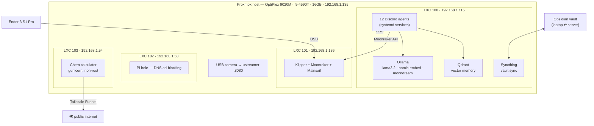

# 🏠 Homelab

A self-hosted, personality-driven **multi-agent AI system** running on a single
second-hand Dell OptiPlex — no cloud, no API bills, no GPU.

Twelve agents are built; **ten currently run** as services on the server (Apex
and Eos exist as code but aren't deployed yet). Each one owns a domain (engineering, 3D printing,
server health, security, studying, training), shares one skills library,
remembers things in a vector database, reads and writes a real Obsidian vault,
and runs on a local LLM. Together they run a 3D printer, watch the server, block
ads, and file a morning briefing.

> **This repo is the front door.** The code lives in the per-component repos
> linked below; the in-depth explanations live in [`docs/`](docs/).

---

## Architecture at a glance

Full detail: **[docs/architecture.md](docs/architecture.md)**

---

## The agent fleet

| Agent | Domain | Repo |
|---|---|---|
| 🔧 **Forge** | Engineering mentor — calc, parts, build checklists, datasheets | [engineering-ai-agent](https://github.com/kubinokitsune/engineering-ai-agent) |
| 🧱 **Mason** | 3D printing — runs, watches, tunes and critiques prints | [printer-ai-agent](https://github.com/kubinokitsune/printer-ai-agent) |
| 🖥️ **Hermes** | Server caretaker — health, auto-restart, anomaly ML, self-healing | [maintenance-ai-agent](https://github.com/kubinokitsune/maintenance-ai-agent) |
| 🛡️ **Warden** | Security — auth watch, auto-ban, ports, posture audit | [security-ai-agent](https://github.com/kubinokitsune/security-ai-agent) |
| 🗂️ **Axiom** | Vault librarian — find, organize, dedupe, MOCs, auto-tagging | [librarian-ai-agent](https://github.com/kubinokitsune/librarian-ai-agent) |
| 📚 **Codex** | Sources (a local NotebookLM) — ingest files/links/**audio** | [codex-ai-agent](https://github.com/kubinokitsune/codex-ai-agent) |
| 🎓 **Chiron** | Tutor — lessons, quizzes, spaced-repetition flashcards | [tutor-ai-agent](https://github.com/kubinokitsune/tutor-ai-agent) |
| 📅 **Kairos** | Scheduler — day plans, calendar, plain-English scheduling | [scheduler-ai-agent](https://github.com/kubinokitsune/scheduler-ai-agent) |
| ☀️ **Iris** | Morning digest — compiles every agent's report + news | [digest-ai-agent](https://github.com/kubinokitsune/digest-ai-agent) |
| 📋 **Scout** | Lacrosse recruiting pipeline | [recruitment-ai-agent](https://github.com/kubinokitsune/recruitment-ai-agent) |
| 🏋️ **Apex** | Gym — training plans and progress | [gym-ai-agent](https://github.com/kubinokitsune/gym-ai-agent) |
| 🌙 **Eos** | Recovery — daily readiness scoring | [recovery-ai-agent](https://github.com/kubinokitsune/recovery-ai-agent) |

Per-agent detail, with every command: **[docs/agents.md](docs/agents.md)**

## Shared components

| Repo | What it holds |
|---|---|
| [homelab-agent-skills](https://github.com/kubinokitsune/homelab-agent-skills) | The `DiscordAgent` base class + every shared skill (vault, vector store, Moonraker, vision, ML, monitoring…). **An agent is an identity + a few commands on top of this.** |
| [homelab-infra](https://github.com/kubinokitsune/homelab-infra) | Printer configs, deploy scripts, autostart, the Discord wiki generator, `.env` template |
| [AI-School-Agent](https://github.com/kubinokitsune/AI-School-Agent) | A standalone **Node.js** IB assignment assistant (Google Classroom + Playwright research → Obsidian briefs). Predates the Discord fleet and runs on its own — kept here because it writes to the same vault. |
| **homelab** (this repo) | Front door + documentation |

---

## Documentation

| Doc | Covers |
|---|---|
| [architecture.md](docs/architecture.md) | Hardware, Proxmox, the three containers, network map, design trade-offs |
| [agents.md](docs/agents.md) | All 13 agents in depth — what each does and its commands |
| [skills-library.md](docs/skills-library.md) | The shared base class, the hooks, how to build a new agent |
| [data-and-memory.md](docs/data-and-memory.md) | Obsidian vault, Qdrant, Ollama, RAG, and the anti-hallucination rules |
| [printer.md](docs/printer.md) | Klipper stack, Mason's vision + ML failure detection |
| [operations.md](docs/operations.md) | Deploy, backup, monitoring, security, remote access |

## Dashboards

| Service | URL |
|---|---|
| Mainsail (printer) | `http://192.168.1.136` |
| Proxmox | `https://192.168.1.135:8006` |
| Qdrant | `http://192.168.1.115:6333/dashboard` |
| Syncthing | `http://192.168.1.115:8384` |
| Pi-hole | `http://192.168.1.53/admin` |
| Printer camera | `http://192.168.1.135:8080` |
| Chem calculator (**public**) | `https://chemcalc.tailf1d903.ts.net` |

All the `192.168.1.x` addresses work from anywhere via Tailscale's subnet route —
same URL at home or away. The calculator is the only one the public can reach.

---

## Design principles

1. **Local-first.** Everything runs on hardware I own. No cloud LLM bills.
2. **Grounded, never fabricated.** Agents answer from real data — live sensor
   readings, actual vault notes, real command lists — or they say they don't
   know. See [the honesty rules](docs/data-and-memory.md#the-honesty-rules).
3. **One base, many agents.** New capabilities added to the shared library
   land in all 13 agents at once.
4. **It should notice before I do.** Print failing, service down, disk filling,
   someone brute-forcing SSH → my phone buzzes.

## License

[MIT](LICENSE) © 2026 Felipe Fonseca
