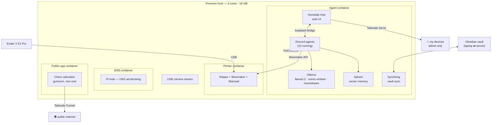

# 🏠 Homelab

A self-hosted, personality-driven **multi-agent AI system** running on a single
second-hand mini desktop PC — no cloud, no API bills, no GPU.

Twelve agents are built; **ten currently run** as services on the server (Apex
and Eos exist as code but aren't deployed yet). Each one owns a domain (engineering, 3D printing,
server health, security, studying, training), shares one skills library,
remembers things in a vector database, reads and writes a real Obsidian vault,
and runs on a local LLM. Together they run a 3D printer, watch the server, block
ads, and file a morning briefing. I talk to them in Discord or through a private
**web hub** that only my own devices can reach.

> **This repo is the front door.** The code lives in the per-component repos
> linked below; the in-depth explanations live in [`docs/`](docs/).

---

## Architecture at a glance

```mermaid
graph TD
    subgraph HOST["Proxmox host — 4 cores · 16 GB"]
        subgraph L100["Agent container"]
            A["Discord agents<br/>(10 running)"]
            O["Ollama<br/>llama3.2 · nomic-embed · moondream"]
            Q["Qdrant<br/>vector memory"]
            S["Syncthing<br/>vault sync"]
            H["Homelab Hub<br/>web UI"]
        end
        subgraph L101["Printer container"]
            K["Klipper + Moonraker + Mainsail"]
        end
        subgraph L102["DNS container"]
            P["Pi-hole — DNS ad-blocking"]
        end
        subgraph L103["Public-app container"]
            C["Chem calculator<br/>gunicorn, non-root"]
        end
        CAM["USB camera stream"]
    end
    PRINTER["Ender 3 S1 Pro"] -->|USB| K
    A --> O
    A --> Q
    A -->|Moonraker API| K
    A -->|host access| HOST
    VAULT["Obsidian vault<br/>(laptop ⇄ server)"] <--> S
    C -->|Tailscale Funnel| WEB["🌍 public internet"]
    H <-->|loopback bridge| A
    H -->|Tailscale Serve| ME["📱 my devices<br/>tailnet only"]
```

Full detail: **[docs/architecture.md](docs/architecture.md)**

---

## The web hub

A private web interface to the whole fleet — dashboard, chat with any agent, a
drag-and-drop calendar, a printer panel with the live camera, server and
security panels, and live alerts — reachable only from my own devices over
Tailscale.
How it works: **[docs/hub.md](docs/hub.md)** · how all of this came to be,
stage by stage: **[docs/history.md](docs/history.md)**

---

## The agent fleet

| Agent | Domain | Status |
|---|---|---|
| 🔧 **Forge** | Engineering mentor — calc, parts, build checklists, datasheets | running |
| 🧱 **Mason** | 3D printing — runs, watches, tunes and critiques prints | running |
| 🖥️ **Hermes** | Server caretaker — health, auto-restart, anomaly ML, self-healing | running |
| 🛡️ **Warden** | Security — auth watch, auto-ban, ports, posture audit | running |
| 🗂️ **Axiom** | Vault librarian — find, organize, dedupe, MOCs, auto-tagging | running |
| 📚 **Codex** | Sources (a local NotebookLM) — ingest files/links/**audio** | running |
| 🎓 **Chiron** | Tutor — lessons, quizzes, spaced-repetition flashcards | running |
| 📅 **Kairos** | Scheduler — day plans, calendar, plain-English scheduling | running |
| ☀️ **Iris** | Morning digest — compiles every agent's report + news | running |
| 📋 **Scout** | Lacrosse recruiting pipeline | running |
| 🏋️ **Apex** | Gym — training plans and progress | built, not deployed |
| 🌙 **Eos** | Recovery — daily readiness scoring | built, not deployed |

Per-agent detail, with every command: **[docs/agents.md](docs/agents.md)**

> Each agent lives in its own private repo (🔒). This hub documents each one in
> depth; the source can be shared on request. Two repos **are public** if you'd
> like to read real code: the [shared skills library](https://github.com/kubinokitsune/homelab-agent-skills)
> (the base class and every skill) and the [chemistry calculator](https://github.com/kubinokitsune/chem-calculator).

## Shared components

| Repo | What it holds |
|---|---|
| [homelab-agent-skills](https://github.com/kubinokitsune/homelab-agent-skills) **(public)** | The `DiscordAgent` base class + every shared skill (vault, vector store, Moonraker, vision, ML, monitoring…). **An agent is an identity + a few commands on top of this.** |
| Infrastructure repo 🔒 | Printer configs, deployment tooling, autostart, the Discord wiki generator, config templates |
| Web hub repo 🔒 | The tailnet-only **web UI**: dashboard, chat with any agent, drag-and-drop calendar — [how it works](docs/hub.md) |
| School-assignment assistant 🔒 | A standalone **Node.js** IB assignment assistant (Google Classroom + Playwright research → Obsidian briefs). Predates the Discord fleet and runs on its own — kept here because it writes to the same vault. |
| **homelab** (this repo) | Front door + documentation |

---

## Documentation

| Doc | Covers |
|---|---|
| [architecture.md](docs/architecture.md) | Hardware, Proxmox, how the lab is carved up, remote access, design trade-offs |
| [agents.md](docs/agents.md) | All 12 agents in depth — what each does and its commands |
| [skills-library.md](docs/skills-library.md) | The shared base class, the hooks, how to build a new agent |
| [data-and-memory.md](docs/data-and-memory.md) | Obsidian vault, Qdrant, Ollama, RAG, and the anti-hallucination rules |
| [printer.md](docs/printer.md) | Klipper stack, Mason's vision + ML failure detection |
| [operations.md](docs/operations.md) | Service model, deploys, backup, monitoring, alerting, security |
| [hub.md](docs/hub.md) | The web UI — one bridge in the base class, tailnet-only access, server-enforced confirmations, the calendar, printer and server panels |
| [history.md](docs/history.md) | How it was built — from a chemistry calculator in May to this, stage by stage, with what each stage taught |

## Dashboards

| Service | Who can reach it |
|---|---|
| **Homelab Hub** (agents, calendar, server) | My own devices only (tailnet) |
| Printer, hypervisor, vector-database, sync and DNS dashboards | My own devices only — addresses deliberately not published |
| Chem calculator (**public**) | `https://chemcalc.<tailnet>.ts.net` |

Everything private is reachable from anywhere over Tailscale, but only from my
own devices. The calculator is the only one the public can reach.

---

## Design principles

1. **Local-first.** Everything runs on hardware I own. No cloud LLM bills.
2. **Grounded, never fabricated.** Agents answer from real data — live sensor
   readings, actual vault notes, real command lists — or they say they don't
   know. See [the honesty rules](docs/data-and-memory.md#the-honesty-rules).
3. **One base, many agents.** New capabilities added to the shared library
   land in all 12 agents at once.
4. **It should notice before I do.** Print failing, service down, disk filling,
   someone brute-forcing SSH → my phone buzzes.

## License

[MIT](LICENSE) © 2026 Felipe Fonseca
