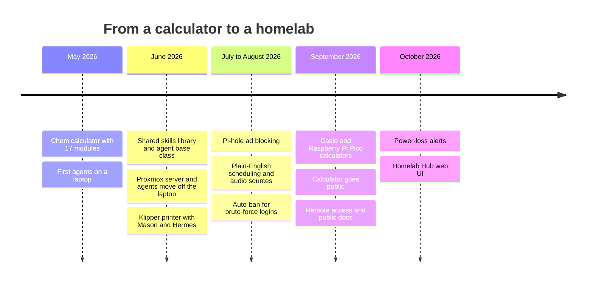
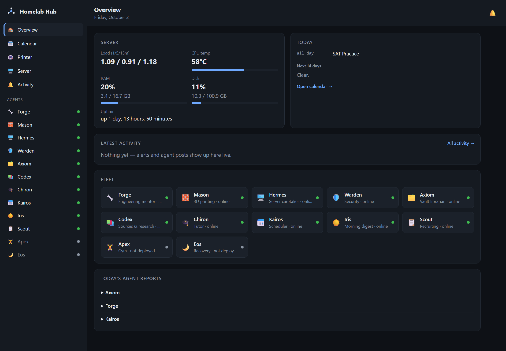

# Development history

How this went from a chemistry calculator to a self-hosted fleet of AI agents
in about five months — May to October 2026 — and what each stage taught.
Dates come from the commit history of the repositories involved.

---

## Stage 1 — A chemistry calculator (May 2026)

**Repo:** [chem-calculator](https://github.com/kubinokitsune/chem-calculator) (public)

It started on **May 22** as a Python chemistry calculator with a small Flask
web page. Three days later it had **17 modules** — mole conversions, oxidation
states, limiting reactants, equation balancing, thermodynamics, an ICE-table
solver, electrochemistry, kinetics — with input validation across all of them
and a calculator-style web interface.

It's the root of everything after it: the first thing shipped for real, and,
four months later, the first thing the server would serve to the public.

## Stage 2 — Agents on a laptop (late May – June 2026)

- **May 26 —** `AI-School-Agent` (Node.js): opens Google Classroom, researches
  an assignment with Playwright, and writes a structured IB brief into Obsidian.
- **May 27 —** Forge began as an Ollama + Open WebUI + n8n + Discord stack, then
  became a plain Python Discord bot talking to a local model.
- **June 16, the turning point.** Instead of writing each agent from scratch, a
  shared library: first a "Step 0" contract (one config object, one result
  shape, one log format, one error policy), then five skills in a single day
  (notifications, Obsidian vault, vector store, web search, file access) and the
  `DiscordAgent` base class. Forge was moved onto it the same day.
- **June 16–22 —** the rest of the fleet in a week: Scout, Axiom, Iris, Kairos,
  Chiron (with Apex and Eos written but not yet deployed), the morning-digest
  pipeline, agent-to-agent mail, the nightly vault librarian, ML auto-tagging and
  error clustering, Codex's source ingestion, and Forge's calculator, parts list
  and build tracker.

All of this ran on a Windows laptop, kept alive by PowerShell scripts — which
taught the first operations lesson. The scripts checked for `python.exe`, but
the agents ran as `python3.10.exe`, so every restart stacked another copy on
top of the survivors: 29 processes at one point, and several Scouts answering
the same Discord message. Running every agent as a systemd service, exactly one
instance each, came out of that.

## Stage 3 — A real server (June 22 – July 1)

The hardware is a second-hand **Dell OptiPlex 9020M Micro** (i5-4590T, 16 GB,
512 GB SSD).

- **Installed blind.** No display ever showed a picture from it, so **Proxmox
  VE 9.2** went on completely headless: an auto-install ISO built with an answer
  file (from a Debian container on the laptop) that installs itself and comes
  up on the network (**June 24**).
- **The move.** LXC 100 for the agents, with Ollama and Qdrant in Docker; the
  Obsidian vault linked laptop ⇄ server with Syncthing (**June 24**); every
  agent moved off the laptop the next day.
- **The printer.** The Ender 3 S1 Pro was flashed with Klipper (**June 25**).
  Two lessons that cost hours: this board only reads new firmware from a folder
  named exactly `STM32F4_UPDATE` — anywhere else it silently boots the stock
  firmware — and a failing SD card looks exactly like a failed flash. Klipper got
  its own container (LXC 101) on its own CPU core, so a busy model can never
  stall a print.
- **Mason and Hermes** — the printer agent with its camera, and the server
  caretaker — went live (**June 25–26**).
- **The biggest speed-up of the project.** Replies were taking 60–110 seconds.
  Not the model and not heat: Ollama ran four threads inside a container
  limited to three cores, and the scheduler throttled them every period. Making
  the thread count match the cores took generation from 0.6 to **9.6 tokens per
  second — about 16× faster** (**June 26**).
- **June 28–29 —** every agent can be taught (`!learn` / `!recall`), and the
  [honesty rules](data-and-memory.md#the-honesty-rules) arrived after the agents
  were caught inventing temperatures, note titles and saved files.
- **July 1 —** Pi-hole ad blocking (LXC 102).

## Stage 4 — Summer (July – August 2026)

Quieter, with one large update on **August 17**: Kairos learned to schedule from
plain English, Codex learned to transcribe audio (faster-whisper on the CPU), and
Warden started banning brute-force logins automatically — with a hard whitelist
so the agent defending the server can never lock its owner out of it.

## Stage 5 — The calculator, round two (September 17–24)

- **An accuracy pass against IB questions** (gas units, ionic equations,
  limiting reactant in grams) and the missing IB topics: solutions, isotopes,
  uncertainties, electron configuration, index of hydrogen deficiency. The web
  page now exposes every module option, and CI runs the tests.
- **On a real calculator.** A port for the Casio fx-CG50, then a native add-in
  written in C (`ChemCalc.g3a`) that runs on the calculator itself, with menus
  and a worked example on every question (**September 18–22**).
- **[chemcalc-handheld](https://github.com/kubinokitsune/chemcalc-handheld)** —
  the same engine on a Raspberry Pi Pico: a handheld prototype on the way to a
  custom PCB (**September 22**).
- **Going public (September 24).** The first plan was a free hosting service;
  free apps there turned out to expire after a month without activity, so it
  came home instead: its own empty, unprivileged container (LXC 103), running as
  a non-root user, published with Tailscale Funnel. If it were ever broken into,
  there would be nothing next to it. Per-visitor rate limiting followed the next
  day, and Warden reports who visits and from which country.

## Stage 6 — Opening it up (September 24 – October 1)

- **Remote access without touching the router** (it isn't mine to configure):
  Tailscale, with the server routing the whole home subnet, so every container
  is reachable at its normal address from anywhere — and Pi-hole blocks ads for
  every device on the tailnet, wherever it is.
- **This repo**, its docs and wiki; MIT licences for the agents; the skills
  library made public.
- **Pages that repeat until answered**, reserved for the two things worth waking
  up for: a print failing while it's still running, and an unexpected login.
- **Less noise:** the anomaly detector stopped flagging every normal load spike,
  and `!help` now reads each agent's live commands so it can't go stale.
- **The vault reorganised** so everything the agents write forms one linked
  "🤖 Homelab" section that the librarian leaves alone.
- **Kairos stopped doing date arithmetic with the language model** after it
  put "tomorrow" five days out; dates are now computed in code.

## Stage 7 — Reliability and a real interface (October 1–2)

- **October 1, the server lost power.** Investigating it showed it wasn't
  software: the journal just stops, and at most startups the clock reads a stale
  date until the network corrects it — a sign of a dead CMOS battery, and of
  real power cuts. Now Hermes reports every reboot, and a watchdog on the laptop
  pages if the server stays unreachable for ten minutes.
- **Kairos, reworked** to ask one clear question instead of silently giving up,
  to schedule real times ("5 hours in the afternoon"), and to flag clashes.
- **The [Homelab Hub](hub.md)** — a web interface to the whole fleet: dashboard,
  chat with any agent, a drag-and-drop calendar, a printer panel with the live
  camera, server and security panels, and a live activity feed — reachable only
  from my own devices, and added without changing a single agent's commands.
- **Building the security panel fixed the traffic report.** Warden had only
  been reading the current, daily-rotated access log, so the public calculator
  looked like it had one visitor a week. The real number was 43 — most of them
  bots probing for WordPress logins that don't exist.

## What's next

- A UPS and a new CMOS battery — the fix for Stage 7's root cause.
- Eos and Apex, fed with Apple Health data by an iOS Shortcut, and the hub as an
  app on the phone.
- SSH keys-only, and closing the two services open to the whole home network
  (the camera stream and rpcbind) — all flagged by the hub's security panel.
- Folding the print labeller into the printer panel.
- Bigger hardware with a PCIe slot (for a GPU) once the four-core box runs out.

## By the numbers

As of October 2, 2026: **19 repositories, 256 commits**.

| Repository | First commit | Commits | |
|---|---|---|---|
| `chem-calculator` | 2026-05-22 | 42 | public |
| `AI-School-Agent` | 2026-05-26 | 7 | 🔒 |
| `engineering-ai-agent` (Forge) | 2026-05-27 | 25 | 🔒 |
| `homelab-agent-skills` | 2026-06-16 | 54 | public |
| `homelab-infra` | 2026-06-16 | 25 | 🔒 |
| the other agents (11 repos) | 2026-06-16 → 06-21 | 78 | 🔒 |
| `chemcalc-handheld` | 2026-09-22 | 4 | public |
| `homelab` (this repo) | 2026-09-24 | 17 | public |
| `homelab-hub` | 2026-10-02 | 4 | 🔒 |

## How it was built

I design the system and make the calls — what each agent is for, how it should
behave, what's safe to automate and what must ask first — run everything on the
real hardware, and find what breaks. Much of the code is written with an AI
coding assistant (Claude Code), which is how one student built this much in five
months. Every failure described above was real, and so was every fix.
