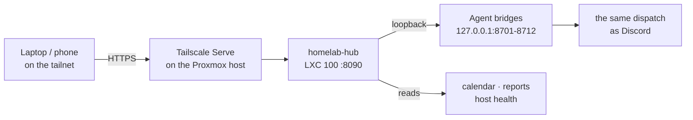

# Homelab Hub — the web UI

Discord was the only way into the agents. That's fine on a phone and clumsy
everywhere else, so the fleet now has a second front end: a small web app,
reachable only from my own devices over Tailscale.

**Repo:** `homelab-hub` 🔒 · **URL:** `https://homelab-server.<tailnet>.ts.net`
(tailnet-only) · installable as an app (PWA)

| Page | What it does |
|---|---|
| **Overview** | Server load, temperature, RAM, disk and uptime; today's and the next 14 days' events; every agent with a live status dot; today's agent reports |
| **Chat** | Talk to any agent exactly like in Discord — plain English or `!commands`, with each agent's commands as one-click shortcuts. Images come through, so Mason's `!snap` shows the camera |
| **Calendar** | A week view (a day view on a phone) of Kairos' plan and events. Click empty time to add, drag to move, click to edit or delete, or type plain English into "Tell Kairos" |
| **Printer** | Live camera, job progress with ETA, temperature chart, live speed/flow/fan tuning, the file list, and every control from pause to e-stop — all through Mason |
| **Activity** | Every agent post, alert and phone page, streamed live; warnings pop a notification and the bell counts what you haven't seen |

Discord keeps working exactly as before. Both are front ends to the same agents,
with the same calendar, vault and memory.

---

## How it's built

### One bridge in the base class, not ten rewrites

Every agent is an identity on top of the shared `DiscordAgent` base
([skills-library.md](skills-library.md)), and every message already flows
through one method, `_dispatch()`: commands, chained commands, plain-English
hooks like Kairos' scheduling, and RAG chat. So the cheapest correct way to add
a second front end was to add it to the base: each agent now also serves a tiny
HTTP API on **loopback only**, and `/chat` feeds the text into that same
`_dispatch()`.

The catch was that handlers were written against Discord's `message` object —
they call `message.reply(...)`, `message.channel.send(file=...)`,
`message.channel.typing()`. A survey of all twelve agents showed they only ever
touch about seven attributes, so the bridge hands them a **stand-in message**
with that same surface that *captures* output instead of sending it, images
included. No handler had to change, and behaviour is identical by construction:
it is literally the same code path.

Agents can also expose structured endpoints with `@agent.bridge_route(...)` —
Kairos uses this to give the calendar its week plan as JSON instead of chat text.

### Tailnet-only, checked twice

The hub can run real commands (start a print, restart a service, ban an IP), so
"only my devices" had to be actually true:

1. It's published with **Tailscale Serve**, not Funnel — the URL doesn't exist
   outside the tailnet.
2. The hub itself only answers **loopback and the Proxmox host**. The useful
   detail: the host is a subnet router and SNATs, so *every* tailnet request —
   via Serve or via the subnet route — arrives from the host's address. A device
   on the home Wi-Fi that isn't on the tailnet connects with its own address and
   gets a **403**. Verified from another container on the LAN, not assumed.

Serve also passes the viewer's tailnet identity, which the sidebar shows.

### Confirmations the UI can't skip

Commands that move the printer, ruin a running print, restart a service, change
the firewall or reorganise the vault (`!estop`, `!cancel`, `!cooldown`,
`!print`, `!home`, `!savez`, `!apply`, `!restart`, `!ban`, `!unban`,
`!organize`, `!refile`, `!nightly`, `!unevent`) are listed in one registry. The
**agent's bridge** refuses them with `409 {"needs_confirm": true, "prompt": …}`
until the request carries `"confirm": true`, and the UI answers the 409 with a
dialog. Because the check lives in the agent and mirrors `_dispatch()`, it also
catches a dangerous command hidden inside a chain (`!today !unevent x`), and a
client can't talk its way past it with `"confirm": "yes"`. Harmless variants are
exempt (`!organize dry` only previews).

### The calendar writes through Kairos

The calendar page never edits the calendar file directly. Adds, moves and
deletes go through Kairos' endpoints, so a drag-and-drop gets the same conflict
check as a chat message — drop an event onto Saturday's golf and the
notification says *"heads up — that overlaps golf."* The fixed blocks drawn on
the grid (school, gym, golf) come from the **same function** the conflict check
uses, so what you see and what Kairos warns about can't disagree.

### The printer panel: through Mason, and frugal with bandwidth

The panel reads structured state from Mason's bridge endpoints, but every
button just sends Mason the same `!command` you'd type in Discord — so his
bounds-checking and the confirmations apply without being reimplemented.

The camera is relayed through the hub rather than linked (it's plain HTTP, which
a browser blocks inside an HTTPS page, and this keeps it tailnet-only). Measuring
it found the raw stream runs at **~25 Mbit/s** — about 11 GB an hour on a phone.
The relay now drops whole frames to cap it at 5 fps (~4 Mbit/s) without
re-encoding anything, which matters on a server whose CPU belongs to Ollama, and
phones default to a snapshot every 3 seconds.

### Live activity without the agents knowing

Agents append every proactive post, alert and phone page to a shared log; the
hub tails it and streams new lines to the browser as server-sent events — about
half a second from an agent writing to a notification on screen. Two details:
an alert is logged **before** it's sent, so it still appears in the hub when
Discord or Pushover is down; and a CRITICAL alert that goes to both Discord and
the phone is one entry, not two.

---

## Bugs it shook out

Building a second front end is a good way to find bugs in the first one:

- **Duplicate background loops.** `on_ready` fires again on every Discord
  reconnect, and the base started each agent's background tasks every time — so
  a long-running Hermes could end up with two watchdogs sending double alerts.
  They now start once.
- **Colliding calendar ids.** Event ids were timestamps to the second; two events
  created within one second shared an id, and deleting one deleted both. A
  double-click on the new calendar would have hit it.
- **An event clashing with itself.** Kairos checked for conflicts *after* saving,
  so a new timed event was reported as overlapping itself. Found by clicking
  through the calendar, not by reading the code.
- **Grading an empty bed.** Mason's `!look` ran its quality model whether or not
  anything was printing — an empty bed came back "imperfect, 40%". It now only
  grades a print in progress (or just finished) and otherwise shows the bed.
- **A command that didn't exist.** `!estop` told you to run `!firmware_restart`,
  which wasn't a command anywhere. Mason now has `!firmware`, which is also the
  panel's "Restart firmware" button — the step needed after switching the printer
  on.

---

## What's next

The hub is the start of an app. Next up: server and security panels, vault
search, uploads and streaming replies. For the phone, the plan is free first —
a home-screen web app, web push, and an iOS Shortcuts automation that sends
Apple Health data (sleep, HRV, resting heart rate) to the hub so Eos can compute
readiness — and a native wrapper only if something genuinely needs one. The full
list is in the `homelab-hub` README.
